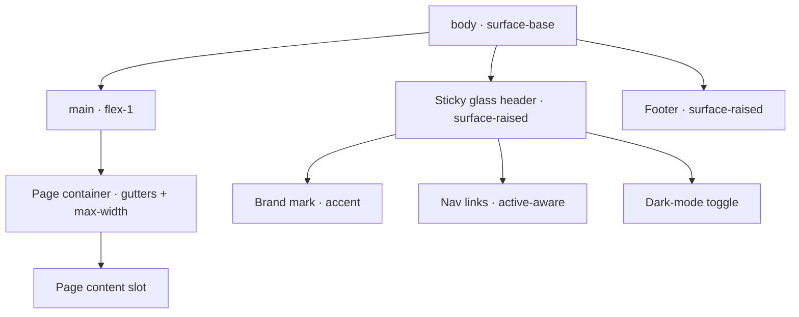
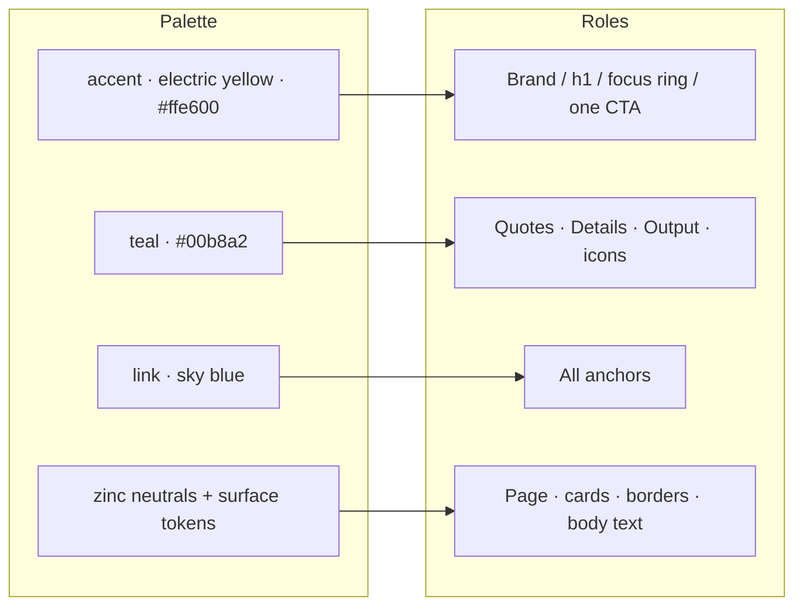

# Phase 7 — Visual Overhaul: Design Specification

> **Status:** Design only. This document is the blueprint for the redesign.
> **Implementation is explicitly out of scope here** — a separate agent executes it,
> following the workflow in `.agents/skills/astro-migration/SKILL.md` and the global
> decisions in `ASTRO_MIGRATION.md` §3 (architecture) and §3.7 (`astro:assets`).
>
> This is the "becomes pretty" pass. Everything before Phase 7 was *buildable, not
> pretty*; here we define the system that makes it pretty — concretely enough that
> implementation is mechanical.

---

## 0. How to read this document

- **§1–§2** set the direction and the boundaries of "preserve the theming up to a point."
- **§3–§7** define the design system: tokens, type, space, elevation, motion. These are
  the source of truth; component specs reference them by token name.
- **§8** is a component-by-component spec, keyed to the real files in `src/`.
- **§9–§11** cover background/atmosphere, accessibility, and motion.
- **§12** is the implementer's checklist: token map, file-by-file touch list, acceptance
  criteria, and explicit out-of-scope items.

Hex values, token names, and class intentions are concrete on purpose. Where a value is a
designer's call rather than a hard constraint, it is marked *(tunable)*.

---

## 1. Design direction

The current site has a real identity buried under ad-hoc styling: **electric yellow on
near-black, dark-first, with a teal/blue secondary and a technical, code-forward tone.**
That identity is worth keeping. What hurts it today:

- Pure `#000000` dark background and flat `#d0d0d0` light background — harsh, no depth.
- Two **identical** palettes (`main` and `turbo` are byte-for-byte the same yellow).
- Surfaces drawn from *both* `zinc` and `slate` interchangeably — no coherent neutral.
- Accent colors chosen per-component (blue, lime, green, sky) with no shared meaning.
- No typographic scale, no display face, default system stack everywhere.
- No spacing / radius / shadow system; `rounded-xl` and `shadow-lg` sprinkled by feel.
- Header is a plain flex bar with no active state, no elevation, no hierarchy.

**The redesign keeps the soul and imposes a system.** Target adjectives:

> **Sleek · technical · high-contrast · quietly playful · fast.**

Think "a well-built developer tool, after dark": confident neutrals, one loud accent used
sparingly, crisp type, generous space, motion that is felt but never waited on. The
electric yellow stays the star — but it earns its loudness by being rare.

---

## 2. What we preserve vs. what we change

**Preserve (the identity — non-negotiable):**

- **Electric yellow** (`#ffe600` family) as the primary brand/accent color.
- **Dark-first**: dark mode is the default and the "designed-for" mode; light mode is a
  first-class but secondary skin.
- **Teal / cyan** (`puerto-rico`) as the cool secondary accent.
- **Blue** as the link color family.
- **Code-forward tone**: monospace details, technical confidence, KaTeX math, Shiki
  blocks all remain central.
- Class-based dark mode (`html.dark` / `html.light`) and the anti-FOUC inline script.

**Change (artistic liberty granted):**

- Replace flat backgrounds with a layered **surface elevation** system (near-black, not
  pure black; warm off-white, not flat gray).
- **Collapse `main` into `turbo`** (they are identical) — one canonical accent ramp.
- Adopt **one neutral ramp** (`zinc`) site-wide; retire incidental `slate`.
- Add a **typographic scale** and an optional **display face** for headings.
- Introduce **spacing, radius, shadow, and ring** scales as tokens.
- Redesign the **header** (sticky, glassy, active-route aware) and **footer**.
- Give **PostCard**, **blockquote/Details/Output**, **CV**, and **prose** a unified look.
- Define **semantic accent roles** so color choice is never ad-hoc again.

---

## 3. Color system

All colors are declared as Tailwind 4 `@theme` tokens in `src/styles/app.css` (the file
already uses the CSS-first `@theme` from Phase 2). The implementer extends that block; the
palette ramps below are the design source of truth.

### 3.1 Accent — `accent` (electric yellow, canonical)

Keep the existing `turbo` ramp values; **rename the role to `accent`** and **delete the
duplicate `main` ramp**, repointing all `main-*` usages to `accent-*`. (Keep `turbo` as an
alias only if a migration shim is convenient — see §12.1.)

| Token | Hex | Primary use |
|---|---|---|
| `accent-50`  | `#feffe7` | tint backgrounds (category chips, light) |
| `accent-100` | `#faffc1` | chip background (light) |
| `accent-200` | `#f9ff86` | hover text (dark) |
| `accent-300` | `#feff41` | links/headings hover (dark) |
| `accent-400` | `#fff40d` | — |
| `accent-500` | `#ffe600` | **brand mark, primary headings (dark), toggle icon** |
| `accent-600` | `#d1aa00` | primary headings (light) |
| `accent-700` | `#a67b02` | brand/heading text (light), chip text (light) |
| `accent-800` | `#895f0a` | post-card title (light) |
| `accent-900` | `#744e0f` | chip background (dark) |
| `accent-950` | `#442904` | deep tint |

> **Discipline:** `accent-500` is *loud*. Use it for the brand mark, the primary `h1`, the
> dark-mode toggle, focus rings, and at most one call-to-action per view. It is not a body
> or link color. Rarity is the point.

### 3.2 Secondary — `teal` (rename of `puerto-rico`)

Keep the `puerto-rico` ramp values; **rename the role to `teal`** for clarity. Used for
the secondary accent: blockquote/Details/Output rails, the active-link underline option,
subtle data-viz framing, scrollbar thumb.

| Token | Hex |
|---|---|
| `teal-50` | `#e5fff9` |
| `teal-100` | `#bdfff2` |
| `teal-200` | `#85ffe9` |
| `teal-300` | `#41fbdf` |
| `teal-400` | `#16dfc4` |
| `teal-500` | `#00b8a2` |
| `teal-600` | `#00998c` |
| `teal-700` | `#02796f` |
| `teal-800` | `#075f59` |
| `teal-900` | `#0b4c48` |
| `teal-950` | `#002928` |

### 3.3 Link — `link` (blue)

Links keep their blue identity, but standardize on one ramp (the existing `secondary`
blue is muted and reads as a UI color, not a link — **use a cleaner blue for links** and
repurpose `secondary` only if still needed). Proposed `link` ramp *(tunable; can map to
Tailwind's `sky`/`blue` if you prefer not to hand-author)*:

| Token | Hex | Use |
|---|---|---|
| `link-300` | `#7dd3fc` | link text (dark) |
| `link-400` | `#38bdf8` | link hover (dark) |
| `link-600` | `#0284c7` | link hover (light) |
| `link-700` | `#0369a1` | link text (light) |

> Inline code currently uses `lime`. **Move inline code to the neutral+accent treatment**
> (see §8.10) so green stops being a fourth, meaningless accent. Reserve green strictly
> for the **success/positive** semantic if ever needed; it is otherwise retired.

### 3.4 Neutrals — `zinc` (site-wide, single ramp)

Adopt **`zinc` everywhere** for surfaces, borders, and body text. Retire incidental
`slate`/`gray` (replace `slate-700`/`gray-200`/`gray-500` etc. with the `zinc` equivalent
during the pass). Tailwind's stock `zinc` ramp is used as-is.

### 3.5 Background & surface elevation (the depth system)

This replaces pure-black / flat-gray. Define semantic surface tokens so components stop
reaching for raw `zinc-900` / `white`. Proposed values:

**Dark (default):**

| Semantic token | Hex | Role |
|---|---|---|
| `--surface-base`   | `#0a0a0b` | page background (near-black, slight warmth) *(tunable)* |
| `--surface-raised` | `#141416` | cards, header, footer |
| `--surface-overlay`| `#1c1c1f` | hover state of raised surfaces, code block chrome |
| `--surface-sunken` | `#060607` | wells, inset code/output areas |
| `--border-subtle`  | `#27272a` (`zinc-800`) | hairlines |
| `--border-strong`  | `#3f3f46` (`zinc-700`) | emphasized dividers |
| `--text-primary`   | `#fafafa` (`zinc-50`)  | body |
| `--text-muted`     | `#a1a1aa` (`zinc-400`) | meta, captions |

**Light:**

| Semantic token | Hex | Role |
|---|---|---|
| `--surface-base`   | `#f4f4f2` | page background (warm off-white, not `#d0d0d0`) *(tunable)* |
| `--surface-raised` | `#ffffff` | cards, header, footer |
| `--surface-overlay`| `#fafaf9` | hover |
| `--surface-sunken` | `#ececea` | wells |
| `--border-subtle`  | `#e4e4e7` (`zinc-200`) | hairlines |
| `--border-strong`  | `#d4d4d8` (`zinc-300`) | dividers |
| `--text-primary`   | `#18181b` (`zinc-900`) | body |
| `--text-muted`     | `#52525b` (`zinc-600`) | meta |

> Implement these as CSS custom properties that flip under `html.dark` / `html.light`
> (the existing `html.dark{}` / `html.light{}` blocks are the natural home). Components
> then reference `var(--surface-raised)` etc., or Tailwind arbitrary values, instead of
> hard-coded `zinc-900`/`white`. This is what gives every surface a consistent, tunable
> depth and kills the zinc-vs-slate drift.

### 3.6 Semantic accent roles (the rule that prevents ad-hoc color)

| Role | Color | Where |
|---|---|---|
| **Brand / primary heading** | `accent` | brand mark, `h1`, hero |
| **Link** | `link` | all anchors in body/nav |
| **Secondary rail / quote** | `teal` | blockquote, Details, Output, sidebars |
| **Focus ring** | `accent-500` | every focusable element (see §10) |
| **Meta / muted** | `--text-muted` | dates, captions, footer |
| **Chip / tag** | `accent` tint | category chips |

If a color is needed that isn't one of these roles, it's a design smell — stop and
reconsider rather than introducing a new hue.

---

## 4. Typography

### 4.1 Faces

| Role | Family | Notes |
|---|---|---|
| **Display / headings** | `"Space Grotesk"` *(tunable — `Geist`, `Sora`, or `Inter Tight` are fine alternates)* | gives the technical-but-characterful feel; used for `h1`–`h3`, brand mark, post titles |
| **Body / UI** | `"Inter"` with system fallback | clean, neutral, excellent at small sizes |
| **Mono** | `"JetBrains Mono"` *(tunable — `Geist Mono`, `IBM Plex Mono`)* | inline code, Output, Shiki blocks, dates/meta accents |

Self-host via `@fontsource` packages (already an npm-friendly pattern) or `astro:assets`
font handling; **subset to latin**, `font-display: swap`, preload only the display weight
used in the header to protect LCP. Font *loading strategy* is finalized in Phase 8 (§8 of
the migration plan) — Phase 7 only fixes the **faces and the scale**.

> If self-hosting fonts is deemed scope-heavy, falling back to a refined system stack
> (`ui-sans-serif`/`ui-monospace`) is acceptable — but the **scale below is mandatory
> regardless of face.**

### 4.2 Type scale

A modular scale (~1.25 / major third), expressed as tokens. Body is the anchor.

| Token | Size / line-height | Use |
|---|---|---|
| `text-xs`   | 0.75rem / 1.1rem | chips, captions, footer |
| `text-sm`   | 0.875rem / 1.4rem | meta, dates, post-card date |
| `text-base` | 1rem / 1.7rem | **body** (note the generous 1.7 leading for reading) |
| `text-lg`   | 1.125rem / 1.75rem | lead paragraphs, Output |
| `text-xl`   | 1.375rem / 1.9rem | post-card title, `h3` |
| `text-2xl`  | 1.75rem / 2.1rem | section headers (`h2`) |
| `text-3xl`  | 2.25rem / 2.4rem | page `h1` |
| `text-4xl`  | 3rem / 1.1 | landing hero `h1` *(tunable)* |

Headings: display face, `font-weight: 700–800`, `letter-spacing: -0.02em` (tighten).
Body: `font-weight: 400`, normal tracking. Meta/labels: `font-weight: 600`, optionally
`uppercase` + `letter-spacing: 0.06em` for small labels (CV section headers, chips).

### 4.3 Prose (blog posts)

The blog uses `@tailwindcss/typography` (`prose`). Define a **single `prose` theme
override** in `app.css` mapped to the tokens above, instead of per-page `prose-*` utility
soup (the CV page currently has a 400-character `prose-*` className — that gets replaced
by the shared theme). Targets:

- `--tw-prose-body` → `--text-primary`; `--tw-prose-headings` → display face + `accent`
  for `h1`, `--text-primary` for `h2`–`h4` with an `accent` left-rule on `h2` *(tunable)*.
- `--tw-prose-links` → `link`; underline on hover only.
- `--tw-prose-quotes` / `quote-borders` → `teal` (matches the Blockquote component).
- `--tw-prose-code`, `pre`, captions → tokens from §3.5/§8.10.
- `max-width`: keep `max-w-none` inside a `max-w-3xl`–`prose` measure column (≈68ch) so
  line length is comfortable; the article container goes from `max-w-4xl` → **`max-w-3xl`
  for text, with figures/code allowed to bleed wider** (see §8.7).

---

## 5. Spacing, radius, elevation

### 5.1 Spacing rhythm

Stick to a 4px base (Tailwind default). Establish **vertical rhythm constants**:

- Section gap (between major page sections): `5rem` desktop / `3rem` mobile.
- Content block gap (paragraph groups, card stacks): `1.5rem`.
- Inline element gap (icon↔label, chip rows): `0.5rem`.

### 5.2 Radius scale (tokens)

| Token | Value | Use |
|---|---|---|
| `--radius-sm` | 0.375rem | chips, buttons, inputs |
| `--radius-md` | 0.625rem | code blocks, small cards |
| `--radius-lg` | 1rem | primary cards (PostCard, SmallContainer, CV panel) |
| `--radius-full` | 9999px | toggle, avatar, tag pills |

Standardize: today everything is `rounded-xl` or `rounded-lg` by feel — map to the scale.

### 5.3 Elevation (shadow + ring)

Dark UIs read depth through **border + subtle glow**, not heavy drop shadows. Define:

| Level | Dark | Light |
|---|---|---|
| `elev-0` (flush) | `border --border-subtle` | `border --border-subtle` |
| `elev-1` (card) | `border --border-subtle` + `shadow: 0 1px 0 rgba(255,255,255,.02) inset, 0 8px 24px -12px rgba(0,0,0,.6)` | `shadow: 0 1px 2px rgba(0,0,0,.04), 0 8px 24px -12px rgba(0,0,0,.12)` |
| `elev-2` (hover / popover) | add `0 0 0 1px var(--border-strong)` + slightly larger soft shadow | larger soft shadow |
| `glow-accent` (rare) | `0 0 0 1px accent-500/40, 0 0 24px -6px accent-500/30` | n/a (skip glow in light) |

`glow-accent` is for the one hero/CTA moment per view, not general cards.

---

## 6. Layout & grid

- **Global max content width:** `--content-max: 72rem` (`max-w-6xl`) for galleries/CV;
  **reading width** `--prose-max: 48rem` (`max-w-3xl`) for article text.
- **Gutters:** `1rem` mobile, `2rem` ≥`sm`, `4rem` ≥`xl`.
- **Header:** full-bleed, sticky, content constrained to `--content-max`.
- **Page vertical padding:** top padding handled by the sticky header offset (no more the
  fixed `mb-16` magic number on the header).

Layout hierarchy:

---

## 7. Motion & interaction language

- **Durations:** micro (hover color/opacity) `150ms`; standard (transforms, reveals)
  `250ms`; deliberate (theme cross-fade) `300ms`. Easing: `cubic-bezier(0.2, 0, 0, 1)`
  (a crisp ease-out) for most, `ease-in-out` for theme.
- **Hover affordances:** cards lift via `translateY(-2px)` + `elev-2`, not just opacity.
- **Links:** color shift + an underline that *grows in* (animated `background-size` on a
  gradient underline, or `text-decoration` with offset) — pick one and use everywhere.
- **Focus:** always a visible `accent-500` ring (§10).
- **Respect `prefers-reduced-motion`:** disable transforms/reveals, keep instant state.
- **No layout-shifting animation**; nothing blocks content paint (zero-JS pages stay
  zero-JS — motion is CSS only, except the existing toggle/Details vanilla scripts).

---

## 8. Component specifications

Each entry: **file → intent → concrete spec.** Implementer matches tokens from §3–§7.

### 8.1 Header / nav — `src/layouts/Layout.astro`

**Intent:** sleek sticky "command bar," clear hierarchy, active-route awareness.

- Sticky (`position: sticky; top: 0; z-40`), `surface-raised` at ~85% opacity +
  `backdrop-blur-md` + bottom `border-subtle` → glassy. Falls back to solid if blur
  unsupported.
- Left: **brand mark** "Rik Voorhaar" in display face, `accent` color, `font-extrabold`,
  tightened tracking. Hover → `accent-300` (dark) / `accent-700` (light).
- Right (or after brand): nav links `Blog · CV · Contact` in body face, `--text-muted`
  default, `--text-primary` on hover, **`accent` underline + `--text-primary` for the
  active route** (detect via `Astro.url.pathname`). Add `aria-current="page"`.
- Dark-mode toggle (see §8.2) sits at the far right, visually separated.
- Replace the `mb-16` spacer with proper sticky offset; content starts cleanly below.
- Mobile: collapse nav into a compact row (links can stay inline — there are only 3 — but
  reduce gutter and hide the brand subtitle if any). No hamburger needed for 3 links.

### 8.2 Dark-mode toggle — `src/components/DarkMode.astro`

**Intent:** keep the sun/moon vanilla-JS toggle; restyle to the system.

- Circular (`--radius-full`) icon button, `36×36`, `--text-muted` icon resting,
  `accent-500` on hover/active; hover bg `--surface-overlay`.
- Animate the icon swap: cross-fade + slight rotate (`200ms`), respecting reduced-motion.
- Keep the inline anti-FOUC script and the localStorage logic **unchanged** (only classes
  on the button/icons change). Visible `accent` focus ring.

### 8.3 Footer — `src/layouts/Layout.astro`

**Intent:** quiet, structured, not the current gradient-blob + bar.

- `surface-raised`, top `border-subtle`, content at `--content-max`.
- Three zones (stack on mobile): left © line in `--text-muted`; center small nav echo
  (Blog/CV/Contact); right social/links row (GitHub, Goodreads, Last.fm, RSS) as small
  icon links in `--text-muted` → `accent` on hover.
- Drop the decorative gradient `
` blocks; depth comes from the surface + border.

### 8.4 SmallContainer — `src/components/SmallContainer.astro`

**Intent:** the standard centered "card page" (home, contact).

- `surface-raised`, `--radius-lg`, `elev-1`, `border-subtle`, `max-w-xl`, generous
  padding (`p-8`), centered with section-gap margins.
- Body text `--text-primary`; remove the global `opacity-90` (use real surface tokens for
  contrast control instead of transparency).

### 8.5 PostCard — `src/components/PostCard.astro`

**Intent:** the most visible component; make it feel like a polished product card.

- Replace the fixed `w-[320px]` + absolute gradient overlay with a clean **`surface-raised`
  card**, `--radius-lg`, `border-subtle`, `elev-1`.
- Fluid width within the gallery grid (§8.6), not a hard 320px.
- Teaser image: top, `--radius-md` (clipped), fixed aspect ratio box (e.g. `16/10`) with
  `object-cover` to kill ragged heights; **render via `astro:assets` `<Image>`** per
  migration §3.7 (this is one of the "remaining raw ``" conversions Phase 7 calls
  out). Subtle zoom on hover (`scale-105`, `300ms`) inside `overflow-hidden`.
- Title: display face, `text-xl`, `accent-800` (light) / `accent-500` (dark), tighten
  tracking; hover lifts to `accent-700`/`accent-300`.
- Date: `text-sm`, `--text-muted`, mono optional for a technical touch.
- Excerpt: `--text-primary`, `text-sm`/`base`, keep the **`teal` left-rule** (replaces the
  current `turbo` border) for 3-line clamp (`line-clamp-3`); "read more →" link in `link`.
- Category chips row at the bottom (mirror the post footer chips, §8.8) *(optional but
  recommended for consistency)*.
- Whole card hover: `elev-2` + `translateY(-2px)`.

### 8.6 PostCardGallery — `src/components/PostCardGallery.astro`

**Intent:** responsive grid, not a flex-wrap of fixed-width cards.

- CSS grid: `repeat(auto-fill, minmax(18rem, 1fr))`, gap `1.5rem`, within
  `--content-max`, centered, with page gutters. Cards stretch to equal heights (grid
  handles it; ensure card is `h-full` flex column so footers align).

### 8.7 Blog post layout — `src/layouts/BlogPostLayout.astro`

**Intent:** a focused reading column with room for media to breathe.

- Outer container `--content-max`; **text column `--prose-max` (`max-w-3xl`) centered.**
- Apply the **shared `prose` theme** (§4.3) — drop the inline `prose-slate`/ad-hoc bits.
- `h1`: display face, `text-3xl`, `accent` (keep `not-prose` so prose doesn't fight it),
  with the post **date + reading-time + category chips** rendered as a meta row directly
  under the title (move/merge the existing footer meta up, or keep both — designer's
  call; recommend a top meta row + a slim bottom footer).
- Figures, Shiki code blocks, and tables may **bleed wider than the text column** (up to
  `--content-max`) via a `.bleed` utility for visual rhythm *(tunable; can be deferred)*.
- Headings keep `scroll-mt` for anchor links; style the autolink anchor (from
  `rehype-autolink-headings`) as a muted `#` that appears on heading hover.

### 8.8 Post footer / category chips — `src/pages/blog/[...slug].astro`

- Top divider `border-subtle`. "Published on …" in `--text-muted`, `text-sm`.
- Chips: pill (`--radius-full`), `accent-100`/`accent-700` (light),
  `accent-900`/`accent-300` (dark), `text-xs`, uppercase label tracking. This is the
  canonical chip style reused by PostCard.

### 8.9 Markdown components

- **`blockquote.astro`** — keep the left-rule pattern; switch the rail to **`teal-500`**
  (dark) / `teal-700` (light) `border-l-4`, italic body in `--text-primary`, slightly
  inset, optional `surface-overlay` background for emphasis *(tunable)*.
- **`Output.astro`** — same `teal` rail; label "Output" as a small uppercase mono badge
  (`--text-muted`), body on `--surface-sunken`, `--radius-md`, mono, horizontal scroll
  preserved. Keep `not-prose`.
- **`Details.astro`** — keep the vanilla-JS toggle + localStorage. Restyle: summary row in
  body face, `--text-primary`, chevron rotates `90°→0°` on open (`200ms`), `teal`
  left-rule on the revealed content (matches blockquote/Output family). Visible focus
  ring on the toggle button. **Trigger is a real `<button>` already — keep it
  keyboard-accessible.**
- **`a.astro`** — `link` color, no underline at rest, **animated underline on hover**
  (§7); external links get a small `↗` glyph *(tunable)*. Visible focus ring.
- **`img.astro` / `ImgSmall.astro`** — route through `astro:assets` `<Image>` where the
  source can be processed (§3.7); rounded `--radius-md`, optional `border-subtle`,
  centered with caption support (`<figcaption>` in `--text-muted`, `text-sm`). Keep a
  plain `` fallback for `public/` SVG/PDF/pre-rendered plots.

### 8.10 Code — Shiki blocks & inline code (`src/styles/app.css`)

- **Shiki theme:** keep `monokai` (migration §3.4 decision) **or** switch to a paired
  light/dark Shiki theme so code follows the toggle *(tunable — recommend
  `github-dark-default` / `github-light-default` dual-theme for cohesion; if changing,
  note it in the Phase 7 completion notes since §3.4 specified monokai).*
- Block chrome: wrap `pre` in `--surface-sunken`, `--radius-md`, `border-subtle`, padding
  `1rem 1.25rem`, horizontal scroll, mono. Optional top bar with three dots / language
  label *(tunable)*.
- **Inline code:** retire the lime color. Use mono, `font-weight: 600`,
  `--surface-overlay` background, `--radius-sm`, `0.15em 0.35em` padding,
  `--text-primary`, optional faint `accent` text on dark for a spark *(tunable)*. Remove
  the manual `margin-left/right` hack.

### 8.11 CV — `src/pages/cv.astro` + `src/components/cv/*`

**Intent:** turn the giant inline `prose-*` panel into a clean, scannable résumé.

- Replace the 400-char inline `prose-*` className with the **shared `prose` theme** +
  small CV-specific overrides only.
- Panel: `surface-raised`, `--radius-lg`, `elev-1`, `--content-max` (or a touch
  narrower), comfortable padding.
- `SectionHeader.astro`: display face, `text-2xl`, `--text-primary`, with a short
  `accent` underline or left-tick; consistent top margin = section gap. (Currently uses
  `slate` → switch to tokens.)
- Experience/Education/Publication/OpenSource items: consistent two-column rhythm on
  desktop (date column muted-mono on the left, content on the right), stacking on mobile.
  Logos via `<Image>` where processable. Bullets tightened, comfortable leading.
- Skill/Tool/flag rows: pill/tag treatment consistent with chips (§8.8).

### 8.12 Landing — `src/pages/index.astro` + `src/components/landing/LandingSection.astro`

**Intent:** a small, confident hero + the hobby list, modernized.

- "Hello" `h1` → optionally promote to a real **hero**: display face, `text-4xl`, with a
  one-line tagline; `accent` on the name. *(tunable — could stay modest in SmallContainer
  or break out to a full-width hero band above the card.)*
- `LandingSection.astro`: the inline icon+label currently uses `lime-700`/`accent`.
  Standardize the label to `accent-700`/`accent-500`, icon inherits, consistent gap.
  Consider rendering each hobby as a small **feature row** (icon chip + bold label +
  body) rather than inline run-in headings *(tunable)*.
- Update the stale "About this website" copy: it still says **Svelte + MDsveX + Node in
  Docker**. Rewrite to **Astro + MDX + Tailwind 4, static, on Cloudflare Pages.** (Content
  fix that belongs with the redesign.)

### 8.13 Contact — `src/pages/contact.astro` + `src/components/contact/ContactItem.astro`

- `ContactItem`: icon in `teal`/`accent` (pick one role — recommend `teal` for the icon,
  `accent` for the type label), value as `link`. Render as a tidy list with consistent
  icon alignment; consider a 2-column grid on `sm+` *(tunable)*. Drop the ad-hoc green.

### 8.14 404 — `src/pages/404.astro`

- On-brand, minimal: big `accent` "404", muted line, a `link` back home. Reuse
  SmallContainer or a centered block. (Quick win for cohesion.)

---

## 9. Background & atmosphere *(tunable, optional polish)*

The original CSS hints at a tiled background (`background-repeat: repeat`) that was never
wired up. Options, in order of restraint:

1. **Flat surface tokens only** (safest, recommended baseline) — depth from elevation.
2. **Subtle noise/grain** overlay (1–2% opacity) on `--surface-base` for texture without
   pattern.
3. **Faint radial accent glow** behind the header/hero on dark mode only
   (`accent-500` at ~4% opacity, large blur) — ties the brand color into the atmosphere
   without touching content contrast.

Keep any background strictly behind content, `z-index` negative, and **disabled or
muted in light mode** to protect contrast. Never let it affect text legibility (§10).

---

## 10. Accessibility (hard requirements)

- **Contrast:** body text ≥ 4.5:1 on its surface in both modes; large headings ≥ 3:1.
  Verify `accent` text especially — `accent-500` on `--surface-base` is fine for large
  display, **not for body**; use `accent-300`+ for small text on dark if ever needed.
- **Focus visible:** every interactive element gets a `accent-500` focus ring
  (`outline` or `ring-2 ring-offset-2`), never `outline: none` without a replacement.
- **Hit targets:** ≥ 40×40px for the toggle, nav links, chips-as-links.
- **Motion:** honor `prefers-reduced-motion: reduce` (§7).
- **Semantics:** keep `<button>` for Details/toggle; `aria-current` on active nav;
  `alt` text on all `<Image>`; `<figcaption>` for captions.
- **Color is never the only signal:** active nav uses underline *and* color; links are
  distinguishable from body by weight/color and underline-on-hover.

---

## 11. Responsive behavior

| Breakpoint | Behavior |
|---|---|
| `< sm` (mobile) | single-column; gutters `1rem`; nav inline compact; PostCard full-width; CV date column stacks above content; section gap `3rem` |
| `sm`–`lg` | gutters `2rem`; gallery 2-up; CV two-column rhythm begins |
| `lg`–`xl` | gallery 3-up; prose at `--prose-max`; section gap `5rem` |
| `≥ xl` | gutters `4rem`; gallery up to 3–4 columns within `--content-max`; figures may bleed |

---

## 12. Implementation handoff

### 12.1 Token migration map (do this first)

| Old usage | New | Action |
|---|---|---|
| `main-*` | `accent-*` | delete `main` ramp; global find/replace `main-` → `accent-` |
| `turbo-*` | `accent-*` | unify; optionally keep `turbo` as alias for one commit |
| `puerto-rico-*` | `teal-*` | rename ramp + usages |
| `secondary-*` (blue) | `link-*` | introduce `link` ramp; repoint links |
| `slate-*`, `gray-*` (surfaces/borders/text) | `zinc-*` / surface tokens | replace |
| `lime-*` (inline code) | surface/mono treatment | retire color (§8.10) |
| raw `zinc-900` / `white` surfaces | `var(--surface-*)` | adopt elevation tokens |
| `rounded-xl`/`-lg` (ad hoc) | `--radius-*` scale | normalize |
| `shadow-lg` (ad hoc) | `elev-*` | normalize |

Centralize tokens in `src/styles/app.css` `@theme` + the `html.dark`/`html.light` blocks.

### 12.2 Files in scope

- `src/styles/app.css` — tokens, surface vars, prose theme, code/inline-code, scrollbar.
- `src/layouts/Layout.astro` — header, footer, sticky/offset, background atmosphere.
- `src/layouts/BlogPostLayout.astro` — reading column, prose, meta row.
- `src/components/DarkMode.astro` — toggle restyle (keep JS).
- `src/components/PostCard.astro`, `PostCardGallery.astro` — card + grid redesign + `<Image>`.
- `src/components/SmallContainer.astro`, `SectionHeader.astro`.
- `src/components/markdown/*` — `a`, `blockquote`, `img`, `ImgSmall`, `Details`, `Output`.
- `src/components/cv/*`, `src/pages/cv.astro` — CV system.
- `src/components/landing/LandingSection.astro`, `src/pages/index.astro` — hero + copy fix.
- `src/components/contact/ContactItem.astro`, `src/pages/contact.astro`.
- `src/pages/404.astro`.
- `astro.config.mjs` — only if switching Shiki theme (§8.10) or adding font handling.

### 12.3 Acceptance criteria

- `npm run build` exits 0; **content pages still ship zero framework JS** (only the
  existing vanilla toggle/Details scripts). No new `client:*` directives.
- One canonical accent ramp (`accent`); `main` ramp deleted; no `slate`/`lime`
  surface/text usages remain (grep clean).
- Surface elevation tokens used site-wide; no raw `#000000` page background.
- Shared `prose` theme applied; the giant inline CV `prose-*` className is gone.
- PostCards render via `astro:assets` `<Image>`, responsive grid, equal heights.
- Dark **and** light modes both pass the contrast bar (§10); anti-FOUC still correct
  under `astro preview`.
- Active nav route is indicated; all interactive elements have a visible focus ring.
- `prefers-reduced-motion` respected.
- Landing "About this website" copy reflects Astro/MDX/Tailwind/Cloudflare.
- Spot-check every route in `astro preview`: `/`, `/blog`, a post (`ukf`), `/cv`,
  `/contact`, `/404`.

### 12.4 Explicitly out of scope (later phases)

- Full image-asset triage `static/` → `src/` and `_headers` cache tuning → **Phase 8**.
- Final font-loading/Lighthouse optimization → **Phase 8** (Phase 7 only sets faces+scale).
- Sätteri / build-speed work → **Phase 10**.
- Any SSR/interactive islands — not happening; zero-JS stance holds.

### 12.5 Suggested sequence for the implementer

1. **Tokens** (`app.css`): accent/teal/link ramps, surface vars, radius/elevation,
   prose theme, code/inline-code. Build still green.
2. **Layout shell**: header (sticky/glass/active) + footer + background. Verify both modes.
3. **PostCard + gallery** (with `<Image>`), then **BlogPostLayout** + markdown components.
4. **CV**, then **landing** (+ copy fix), **contact**, **404**.
5. Full `astro preview` pass against §12.3, then record **Phase 7 completion notes** in
   `ASTRO_MIGRATION.md` per the skill template.

---

## 13. Quick visual reference

**One loud color, used rarely. One cool secondary, for structure. One link blue. Neutrals
do the heavy lifting, with real depth. That's the whole system.**
