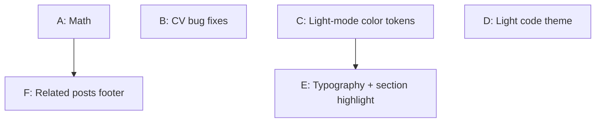

# Post-launch Fix Plan — rikvoorhaar.com

This document plans and tracks fixes for issues found while reviewing the live Astro site.
Fixes are implemented one group at a time; completion notes are appended to each section.

**Status:** A ✅ &nbsp; B ✅ &nbsp; C ⬜ &nbsp; D ⬜ &nbsp; E ⬜ &nbsp; F ⬜ Each fix group is
independent enough to be implemented and verified one at a time. Groups are ordered by a
suggested implementation sequence (see §Dependencies & order), but the user will verify
each one individually before moving on.

Conventions follow `ASTRO_MIGRATION.md` and the `astro-migration` skill: zero framework
JS, Tailwind 4 `@theme` tokens in `src/styles/app.css`, MDX component map in
`src/pages/blog/[...slug].astro`, verify with `npm run build` + `astro preview`.

---

## Summary

| # | Fix group | Original issues | Primary files | Risk |
|---|---|---|---|---|
| A | Math rendering | "Math doesn't render at all" | `remark-mdx-math.mjs` | Low, isolated |
| B | CV bug fixes (dropdowns, Coursera links, work-experience sectioning) | 3 CV issues | `src/components/cv/*`, `src/pages/cv.astro` | Low–med |
| C | Light-mode color & contrast (accent + links) | yellow too light, links too light | `src/styles/app.css` + components using accent/link colors | Med (touches many files) |
| D | Light code theme | code is monokai in light mode | `astro.config.mjs`, `src/styles/app.css` | Low |
| E | Typography overhaul + section highlight | fonts, size, line spacing, section "highlight font" | `package.json`, `src/styles/app.css`, `src/layouts/Layout.astro`, `SectionHeader.astro` | Med |
| F | "Keep reading" related posts footer | add links to other posts | `src/pages/blog/[...slug].astro`, maybe new component | Low |

---

## Fix A — Math rendering (root cause found)

### Diagnosis
Math is **not** failing silently — KaTeX runs, but renders **empty** output. Verified in a
fresh build: `dist/blog/bayes_exam/index.html` contains 36 `<span class="katex">` wrappers,
but every one has an **empty** TeX annotation and an **empty** `katex-html` span:

```html
<span class="katex"><span class="katex-mathml"><math ...><semantics><mrow></mrow>
<annotation encoding="application/x-tex"></annotation></semantics></math></span>
<span class="katex-html" aria-hidden="true"></span></span>
```

The math **value is lost between mdast and hast**. In `remark-mdx-math.mjs`, each `math` /
`inlineMath` node is created with `data.hName` and `data.hProperties.className`, but **never
sets `data.hChildren`** (or a child text node). `remark-rehype` therefore emits an empty
`<div class="math math-display">` / `<span class="math math-inline">`, and `rehype-katex`
renders empty math. (The real `remark-math` always attaches `data.hChildren = [{type:'text',
value}]`; this hand-rolled replacement omitted it.)

The rest of the pipeline is fine: the `\x00LB\x00`/`\x00RB\x00` brace-escape tokens are
correctly restored to `{`/`}` in the plugin, and KaTeX CSS is already imported in
`Layout.astro` (`import 'katex/dist/katex.min.css'`).

### Plan
- In `remark-mdx-math.mjs`, add `data.hChildren = [{ type: 'text', value: mathValue.trim() }]`
  to **all three** node-creation branches (the two `math` display branches and the
  `inlineMath` branch). This carries the TeX source into hast where `rehype-katex` reads it.
- Sanity check inline math: posts use `$$...$$` for inline too (e.g. `$$S$$`), which the
  current regex already matches, so no single-`$` handling is required. Note this in the plan
  but do not add `$...$` support unless a post needs it.

### ✅ Completed

Three root causes found beyond the original `hChildren` issue:

1. **Missing `hChildren`:** Added `hChildren: [{ type: 'text', value: mathValue.trim() }]` to
   all three node-creation branches in `remark-mdx-math.mjs`.
2. **Null-byte sentinels stripped by MDX:** `escape-math-braces.mjs` used `\x00LB\x00` /
   `\x00RB\x00` sentinels, but MDX strips null bytes during parsing. The remark plugin searched
   for the null-byte-wrapped form but received plain `LB`/`RB`. Fixed by removing null bytes
   from both files and updating all 22 source files with a one-off Perl fix.
3. **Markdown parser consumes `_` and `*` before plugin runs:** LaTeX subscripts (`x_k`) and
   `\begin{align*}` were being parsed as markdown italics/emphasis, splitting text nodes with
   `<em>` tags. Extended `escape-math-braces.mjs` to also escape `_` → `US` and `*` → `ST`,
   with matching restoration in `remark-mdx-math.mjs`.

**Files changed:** `blog/remark-mdx-math.mjs`, `blog/escape-math-braces.mjs`,
`blog/src/posts/*.mdx` (22 files).

**Build:** 25 pages, 0 LaTeX warnings, 0 leftover sentinels across all math-heavy pages
(deconvolution, ukf, bayes_exam, gmres, normal_data, thesis — 50–80 math symbols each).

---

## Fix B — CV bug fixes (3 sub-issues, same area)

All three are isolated to the CV and naturally verified together on `/cv`.

### B1 — "More info" dropdowns do nothing
**Root cause:** In `src/components/cv/OpenSource.astro` and `src/components/cv/Publication.astro`
the bottom inline `<script>` references `document.getElementById('btn-{uid}')` — but Astro
does **not** interpolate frontmatter (`{uid}`) inside `<script>` bodies; the script is bundled
as a static module, so it literally looks for the element id `btn-{uid}` and finds nothing.
Additionally, one near-identical script is emitted per instance, which Astro hoists/dedupes.

**Plan:** Replace the per-instance `getElementById('…{uid}…')` approach with the
**data-attribute delegation pattern already proven** in `src/components/markdown/Details.astro`
(single `<script>`, `querySelectorAll('[data-…]')`, toggle via `data-*` hooks). Apply to both
`OpenSource.astro` and `Publication.astro`. Options: factor a shared toggle component/snippet,
or copy the Details pattern into each. Prefer one shared markup pattern to avoid drift.

### B2 — Coursera specialization links show as plain `<a>…</a>` text
**Root cause:** Course entries live in `src/data/cv.ts` under `courses[].entries[].note` and
contain raw HTML (`<a href="https://www.coursera.org/...">Coursera certificate</a>`). They are
rendered by `src/components/cv/Education.astro` via `{entry.note}`, which **escapes** HTML.
(`Publication.astro` already uses `set:html={info}`, which is why publication links work.)

**Plan:** Render `entry.note` in `Education.astro` with `set:html`. Confirm no other note/info
fields rely on escaping. Optionally unify: `OpenSource.astro` currently renders `{info}` as
plain text (no HTML there today) — consider `set:html` for consistency so future HTML works.
Keep the style of the existing link colors (will be governed by Fix C tokens).

### B3 — Clearer sectioning of work experience
**Current state:** `cv.astro` maps `cv.experience` into stacked `Experience.astro` blocks with
only `mb-4`; roles run together with no separators.

**Plan (visual only, no data change):** Add clearer per-role separation — e.g. a subtle divider
(`border-top: 1px solid var(--border-subtle)`) or light card/elevation per role, increased
spacing, and stronger employer/role/date hierarchy. Implement in `Experience.astro` (and/or a
wrapper in `cv.astro`). Keep consistent with the site's elevation system (`elev-1`,
`--surface-raised`). This is the most subjective item — propose 1 option, iterate on review.

### Acceptance / verification
- `/cv`: clicking "More info" on every publication **and** open-source/technical-writing entry
  toggles content (chevron rotates), no console errors.
- Coursera certificate links render as real clickable links under "Online courses".
- Work-experience roles are visually distinct/scannable.
- `npm run build` exits 0; no framework JS added (vanilla `<script>` only).

### ✅ Completed

**B1 — Toggles:** Replaced per-instance `getElementById('btn-{uid}')` in `OpenSource.astro` and
`Publication.astro` with data-attribute event delegation (`data-cv-toggle-group/btn/chevron/content`,
identical script in both — Astro dedupes). Guard `cvBound` prevents double-binding.

**B2 — Coursera links:** Changed `Education.astro` to render `entry.note` with `set:html`
instead of escaped `{entry.note}`. All three Coursera certificate URLs now render as clickable links.

**B3 — Work experience sectioning:** Added optional `first` prop to `Experience.astro`;
non-first roles get `border-t` with `var(--border-subtle)` + `pt-4` + increased `mb-6`.
`cv.astro` passes `first={i === 0}` from the map index.

**Files changed:** `src/components/cv/OpenSource.astro`, `src/components/cv/Publication.astro`,
`src/components/cv/Education.astro`, `src/components/cv/Experience.astro`, `src/pages/cv.astro`.

---

## Fix C — Light-mode color & contrast (accent + links)

Dark mode is fine; light mode has illegible bright-yellow text and too-light links.

### Diagnosis
- The accent yellow `--color-accent-500` (`#ffe600`) is used as **text/foreground** in many
  places (brand, page `<h1>`s, section underline, `PostCard` titles, `OpenSource`/`Publication`
  titles, `Education` titles, category chips). On the light surface (`#f4f4f2`/`#ffffff`) this
  has almost no contrast.
- Links are inconsistent: `.prose` uses `--color-link-700` in light (OK), but
  `src/components/markdown/a.astro` defaults to `--color-link-300` and only overrides to
  `link-700` under `html.light a`. Other UI links (`PostCard` "read more", nav, etc.) hardcode
  `var(--color-link-300)` inline regardless of theme → too light in light mode.

### Plan
- Introduce **theme-aware semantic tokens** in `src/styles/app.css` so components don't each
  branch on theme. In the `html.dark`/`html:not(.light)` and `html.light` blocks add:
  - `--text-accent` → `var(--color-accent-500)` (dark) / `var(--color-accent-700)` or `-600`
    (light, pick the darkest that still reads as "yellow/gold").
  - `--text-link` → `var(--color-link-300)` (dark) / `var(--color-link-700)` (light).
  - Optionally `--chip-bg` / `--chip-fg` to replace the per-component `html.light … !important`
    overrides currently duplicated in `PostCard.astro` and `[...slug].astro`.
- Replace hardcoded `var(--color-accent-500)` **text** usages with `var(--text-accent)` and
  hardcoded `var(--color-link-300)` link usages with `var(--text-link)` across:
  `Layout.astro` (brand, active nav), `BlogPostLayout.astro` (h1), `cv.astro` (h1),
  `SectionHeader.astro`, `PostCard.astro`, `cv/OpenSource.astro`, `cv/Publication.astro`,
  `cv/Education.astro`, `markdown/a.astro`. (Leave **non-text** accent uses — borders,
  underlines, glows, chip backgrounds — as the raw ramp unless contrast demands otherwise.)
- Verify the yellow chosen for light mode against text on `--surface-raised`/`--surface-base`.

### Acceptance / verification
- In light mode: headings, brand, links, "read more", and CV titles are clearly legible
  (target WCAG AA for body-size text where feasible; large headings may use AA-large).
- Dark mode is visually unchanged.
- `astro preview` toggling the theme on `/`, `/blog`, `/blog/<post>`, `/cv`, `/contact`.

> Dependency note: Fix E's "section highlight" color choice builds on the tokens added here.

---

## Fix D — Light code theme (Shiki)

### Diagnosis
`astro.config.mjs` sets `markdown.shikiConfig.theme: 'monokai'` — a single dark theme used in
both modes. `app.css` also forces `pre { background: var(--surface-sunken) }`, overriding the
Shiki background.

### Plan
- Switch to Shiki **dual themes** in `astro.config.mjs`:
  `shikiConfig: { themes: { light: 'github-light' /* or 'one-light'/'min-light' */, dark:
  'monokai' /* keep, or 'github-dark' */ } }`. Astro then emits `--shiki-light*` and
  `--shiki-dark*` CSS variables and `style="…--shiki-dark…"` on tokens.
- Add CSS in `app.css` to select the active theme by class: default to dark vars, and under
  `html.light` map the Shiki token `color`/`background-color`/etc. to the `--shiki-light*`
  variables (standard Astro dual-theme snippet). Reconcile with the existing
  `pre { background: var(--surface-sunken) }` rule — either drop the forced background in favor
  of Shiki's per-theme bg, or set the `pre` background from `--shiki-light-bg`/`--shiki-dark-bg`.
- Keep the inline-code styling (`:not(pre) > code`) as-is; only fenced blocks change.

### Acceptance / verification
- Code blocks are readable in **both** themes (light theme has dark text on light bg).
- No layout shift; `pre` border/radius preserved.
- `npm run build` exits 0; spot-check posts with code (`ukf`, `selfhosted`, `python_docx`,
  `gmres`).

---

## Fix E — Typography overhaul + section highlight

Covers: font family swap, larger body size, tighter line spacing, and the "section highlight
font/color" request.

### Diagnosis
- Current fonts: **Space Grotesk** (headings + body) and **JetBrains Mono** (code), self-hosted
  via `@fontsource/*` imports in `app.css`; `Layout.astro` preloads a Space Grotesk woff2.
- `html { font-family: 'Space Grotesk' … }` sets body; a `pre,code,kbd,samp` rule sets mono.
- Body size/line-height come from Tailwind Typography (`.prose`) defaults (line-height ~1.75),
  which the user finds too small with too-loose leading.
- `SectionHeader.astro` uses `--text-primary` with a short accent underline.

### Plan
- **Fonts:** add `@fontsource/raleway` (headings) and `@fontsource/source-sans-3` (body) to
  `package.json`; remove Space Grotesk (and its `@fontsource/space-grotesk` import + preload) if
  fully replaced. Import the needed weights in `app.css` (e.g. Raleway 600/700/800, Source Sans 3
  400/600/700). Set:
  - `html { font-family: 'Source Sans 3', … }`
  - a headings rule (`h1,h2,h3,h4 { font-family: 'Raleway', … }`) — note `.prose` headings need
    the family applied too.
  - Update the woff2 **preload** in `Layout.astro` to the new heading font file (Raleway 700) to
    keep CLS low; drop the Space Grotesk preload.
- **Size & leading:** increase base size (e.g. set `font-size` on `html`/`body` or `.prose`
  `font-size`) and tighten `.prose` `line-height` (e.g. ~1.6). Tune `.prose` `max-width` only if
  needed. Keep changes in `app.css` so all prose/pages inherit.
- **Section highlight (issue 6):** give `SectionHeader.astro` (CV) and prose `h2`/`h3` a
  "highlight" treatment — the Raleway display font plus a color **between** body text and the
  bright yellow. Recommended: `--color-teal-500/600` or a new `--text-heading-accent` token
  (e.g. teal in both modes, or muted gold). Decide one and apply consistently to CV section
  headers and in-post section headings.

### Acceptance / verification
- Raleway on all headings/section headers; Source Sans 3 on body; JetBrains Mono unchanged.
- Body text noticeably larger; line spacing tighter; no overflow/wrapping regressions.
- Section headers use the chosen highlight font+color and read well in both themes.
- No FOUT/large CLS on first paint (preload updated); `npm run build` exits 0.

> Dependency note: do Fix C first so the highlight/accent colors are theme-aware.

---

## Fix F — "Keep reading" related posts footer

### Diagnosis
`src/pages/blog/[...slug].astro` ends with a small footer (date + category chips). There is no
cross-linking to other posts. A `PostCard.astro` component already exists and is used on the
blog index.

### Plan
- In `[...slug].astro`, after rendering content, compute a short list of **other** posts:
  prefer posts sharing a category with the current one, fall back to most recent, exclude the
  current post and drafts, cap at ~3.
- Render them in a "Keep reading" section. Reuse `PostCard.astro` for visual consistency, or add
  a lighter compact list/component if full cards feel heavy at the bottom of an article.
  (If reusing PostCard, place outside `.prose` / `not-prose` to avoid prose styling.)
- Optional: also surface this on the CV `technical_writing` section is **not** in scope.

### Acceptance / verification
- Each post shows up to 3 relevant other posts at the bottom, none linking to itself.
- Teaser images, titles, and links resolve correctly (astro:assets).
- Looks correct in both themes; `npm run build` exits 0.

---

## Dependencies & suggested order



Recommended sequence:
1. **A — Math** (critical, fully isolated, quick win).
2. **B — CV bug fixes** (broken functionality, self-contained).
3. **C — Light-mode color tokens** (foundational; introduces semantic tokens E reuses).
4. **D — Light code theme** (independent; can swap with D/E ordering).
5. **E — Typography + section highlight** (depends on C's color tokens).
6. **F — Related posts footer** (independent; nice-to-have, do last).

A, B, D, and F are mutually independent and could be reordered freely. C should precede E.

## Notes / non-goals
- No data/content rewrites beyond rendering fixes (e.g. `cv.ts` HTML is kept; we fix how it's
  rendered).
- Maintain the project's zero-framework-JS rule: all interactivity stays in vanilla `<script>`.
- Keep `remark-mdx-math.mjs` brace-token pipeline intact (only add `hChildren`).
- After all fixes land, consider recording a short note in `ASTRO_MIGRATION.md` (post-launch
  polish) and removing the backward-compat color aliases flagged for "post-Phase 7 cleanup".
